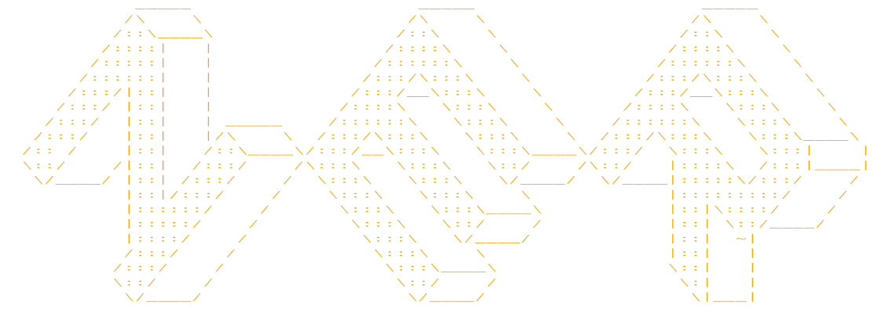

# NER

## Usage
You can run this program using [docker](https://www.docker.com/).

```
docker pull jiadian/cner
docker run -p 80:80 jiadian/cner
```
Go to the following URL.<br>
```
http://localhost/home
```
You will see the following display.


## Model Details
This project uses **Hidden Markov Models** and **Viterbi algorithm** to derive optimal paths.


