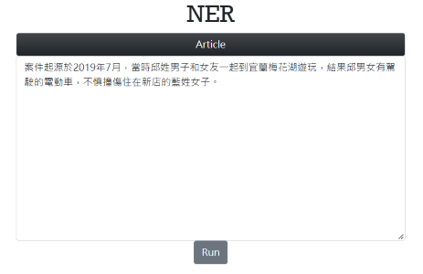
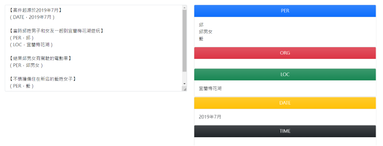

# NER

## Usage
You can run this program using [docker](https://www.docker.com/).

```
docker build -t nerimage .
docker run -d --name nercontainer -p 80:80 nerimage
```
Go to the following URL.<br>
```
http://127.0.0.1/home
```
You will see the following display.





## Model Details
This project uses **Hidden Markov Models** and **Viterbi algorithm** to derive optimal paths.


